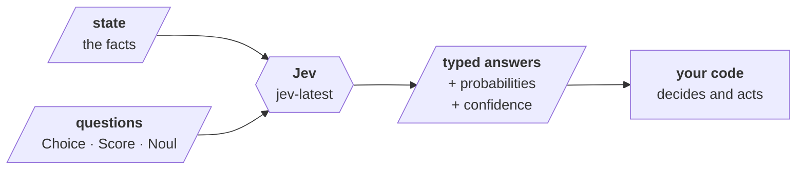
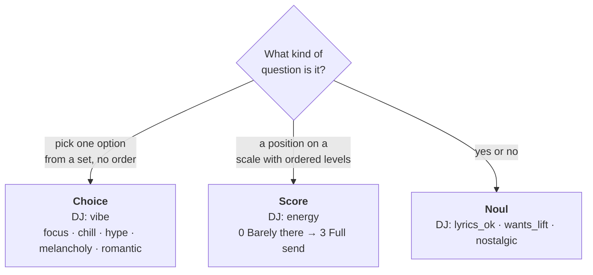
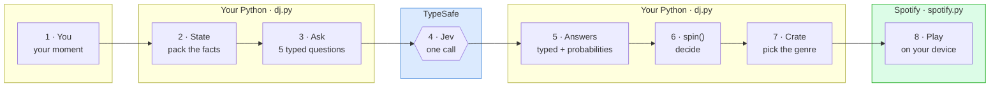
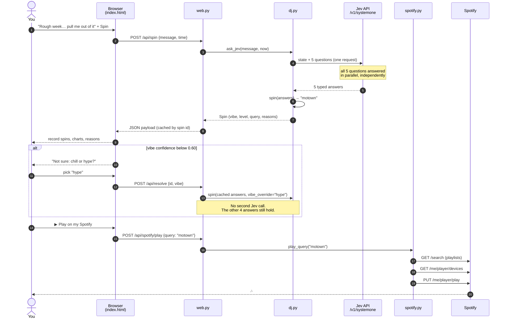
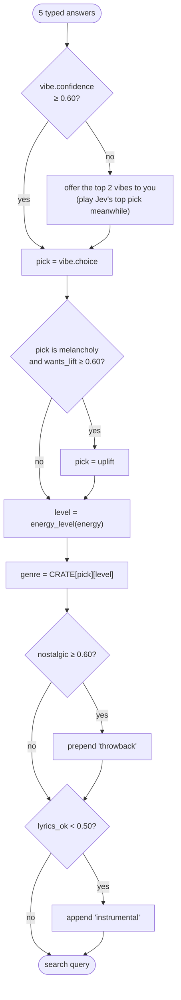
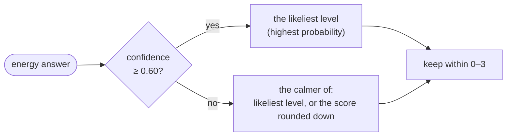
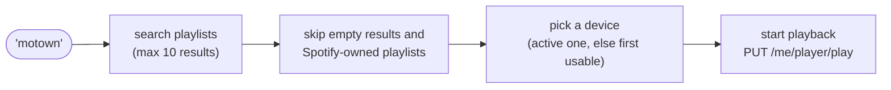
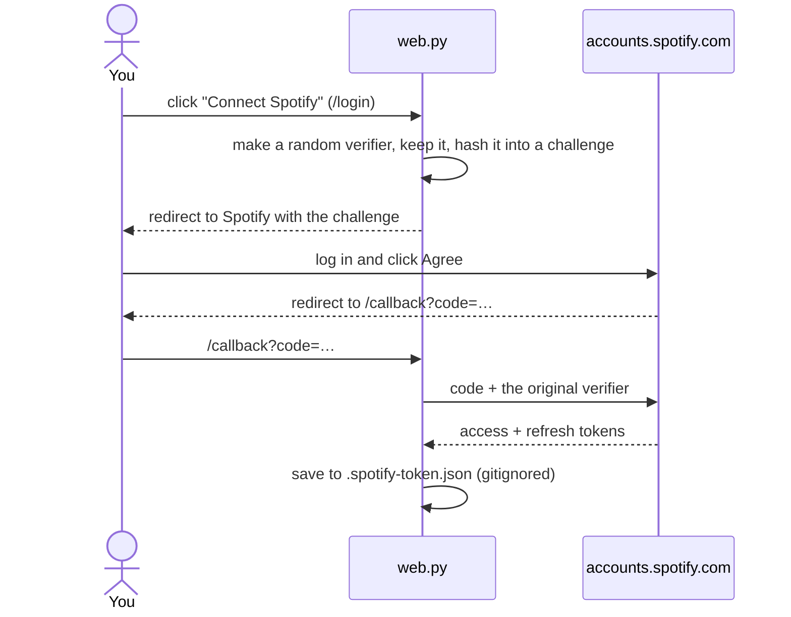

# How jev-dj works: a first look at Jev

This guide follows **one real spin** of the DJ from your sentence to music on your speakers, and explains the Jev ideas behind each step. All numbers below come from an actual call to `jev-1.13.0`.

> **The one-sentence version:** Jev answers five small, typed questions about your moment; plain Python turns those answers into a music pick; Spotify plays it.

---

## 1. Jev in one minute

Jev (TypeSafe's "System One" model) is **not a chatbot**. You never ask it to *write* anything. You give it:

- **state**: the facts to look at (here, your message and the clock), and
- **questions**: each with a fixed set of possible answers you define,

and it returns **typed answers with probabilities**: numbers your code can branch on directly. No prose to parse, no JSON to scrape out of a paragraph.



| | A chat LLM | Jev |
|---|---|---|
| You send | a prompt | state + typed questions |
| You get back | text | one answer per question, from the options *you* defined |
| "How sure are you?" | you have to ask, and it may bluff | built in: `probabilities` and `confidence` on every answer |
| Who decides what happens next | often the model | **your code**, always |

That last row is the big idea of this project: **Jev makes snap judgments, Python makes decisions.**

---

## 2. The three question types

Every Jev question is one of three *primitives*. The DJ uses all three.



| Primitive | What comes back | Real answer from our spin |
|---|---|---|
| **Choice** | `choice` (the top option), `probabilities` for every option, `confidence` | `melancholy`, P = 1.00, confidence 1.00 |
| **Score** | `score` (can land *between* levels), `probabilities` per level, `legend`, `confidence` | 2.06, confidence 0.80 |
| **Noul** | `noul`: the probability the answer is **yes** (0 to 1) | `wants_lift` = 0.83 |

Two traps worth knowing on day one:

- **A Noul of 0.5 does not mean "medium."** It means "I can't tell yes from no." If you want *how much*, ask a Score.
- **A Score of 2.06 is not a level.** It's an average weighted by probability (explained in stop 5 below). Your code decides which level to act on.

---

## 3. The big picture: eight stops

The web app shows these same eight stops in its **Inside jevbot** strip. Only one of them is Jev. Everything around it is ordinary code you control.



| Stop | What happens | Where |
|---|---|---|
| 1 · You | You type a moment, or pick a sample | `static/index.html` |
| 2 · State | Code packs your message **and the clock** into `state` | `build_state()` in `dj.py` |
| 3 · Ask | Five questions with fixed answer options | `build_questions()` in `dj.py` |
| 4 · Jev | **One** HTTPS call with all five questions | `ask_jev()` in `dj.py` |
| 5 · Answers | Typed answers come back as a `DJAnswers` object | `DJAnswers` in `dj.py` |
| 6 · spin() | Thresholds and rules turn answers into a pick | `spin()` in `dj.py` |
| 7 · Crate | Look up `CRATE[vibe][energy level]`, add modifiers | `CRATE` in `dj.py` |
| 8 · Play | Search Spotify for a playlist and start it | `play_query()` in `spotify.py` |

---

## 4. One spin, end to end

Here's the full conversation between the pieces when you press **Spin** and then **▶ Play on my Spotify**.



Notice that Jev appears **once**. Everything after the answers come back is deterministic Python you can read, test and change.

---

## 5. Stop by stop, with real data

The example moment: *"Rough week and I'm feeling low, but I want something to pull me out of it."* at 14:00 on a Thursday.

### Stop 2 · State: code packs the facts

```json
{
  "listener": { "message": "Rough week and I'm feeling low, but I want something to pull me out of it." },
  "clock":    { "local_time": "14:00", "weekday": "Thursday" }
}
```

- **Structure the state like data**, not like a prompt. Questions point into it with backtick paths: `` `listener.message` ``, `` `clock.local_time` ``.
- **Give Jev the facts your code already knows.** Python knows the time for certain, so it puts it in the state and Jev never has to guess. Try `--time 07:00` vs `--time 23:30`: energy shifts a little (0.99 at 19:30, 0.83 at 23:30 for the same dinner message) without the clock overpowering what you wrote.

### Stop 3 · Ask: five typed questions

| ID | Type | The question | Possible answers | Used by `spin()` for |
|---|---|---|---|---|
| `vibe` | Choice | What's the vibe of the listener's moment? | focus, chill, hype, melancholy, romantic | the crate row |
| `energy` | Score | How much energy should the music have, given the time? | 4 levels, Barely there → Full send | the crate column |
| `lyrics_ok` | Noul | Would vocals fit what they're doing? | yes / no | add "instrumental" |
| `wants_lift` | Noul | Do they want music to *change* their mood? | yes / no | flip melancholy → uplift |
| `nostalgic` | Noul | In the mood for throwbacks? | yes / no | add "throwback" |

**The IDs (`vibe`, `energy`, …) are for your code only.** Jev reads the `instructions` and `criteria`, so everything it needs to know goes there.

The `vibe` question uses **structured criteria**. Each option says what it covers *and what it doesn't*, which sharpens the line between neighbours like focus and chill:

```json
"vibe": {
  "type": "choice",
  "instructions": {
    "question": "What is the vibe of the listener's moment in `listener.message`?",
    "focus": "Classify how the listener feels or what they are doing now, not the music they hope for."
  },
  "criteria": {
    "focus":      { "what": "Concentrating: studying, coding, writing, deep work", "not_for": "Winding down or relaxing with no task" },
    "chill":      { "what": "Unwinding: slow mornings, cooking, lazy afternoons",  "not_for": "Tasks that need concentration" },
    "hype":       { "what": "Getting pumped: workouts, pre-game, cleaning, celebrating", "not_for": "Relaxing, concentrating, or feeling low" },
    "melancholy": { "what": "Feeling sad, low, heartbroken, lonely, or grieving", "not_for": "Warm, happy love" },
    "romantic":   { "what": "Date night, affection, being in love", "not_for": "Heartbreak or loss" }
  }
}
```

A Noul can describe both sides too:

```json
"lyrics_ok": {
  "type": "noul",
  "instructions": "Would vocals and lyrics fit what the listener in `listener.message` is doing?",
  "criteria": {
    "true":  "Words won't get in the way: driving, working out, relaxing, feeling feelings",
    "false": "Words would distract: reading, writing, studying, or falling asleep"
  }
}
```

In Python these are `Choice(...)`, `Score(...)` and `Noul(...)` objects from `typesafe_sdk`; the SDK turns them into exactly this JSON.

### Stop 4 · Jev: one call, five answers

```python
client.system_one(
    state=build_state(message, now),
    questions=build_questions(),   # all five at once
    model="jev-latest",
    response_model=DJAnswers,
)
```

Jev answers every question **in parallel and independently** against the same state. That has three consequences:

1. **Asking more questions is cheap.** This whole call used 826 input tokens. Separate calls would each re-send the state and add a round trip; TypeSafe's [parallel questions cookbook](https://docs.typesafe.ai/cookbooks/parallel_questions) measured 13 questions in one call as 12.2× cheaper and 10× faster than one call per question.
2. **You can ask "speculative" questions.** `wants_lift` is asked every time, even though it only matters when the vibe turns out to be melancholy. See [patterns](#6-the-jev-patterns-in-this-project).
3. **Answers don't depend on each other.** Jev doesn't know what it answered for `vibe` when it answers `energy`. That's what lets you override the vibe later without calling again.

> **When *is* a second call right?** When the first answer changes the **state** or the **set of options** for the next question. For example: once you have Spotify's 10 search results, asking Jev "which of these playlists fits?" would be a legitimate second call, because those options didn't exist before.

### Stop 5 · Answers: reading what came back

The real response, trimmed:

```json
{
  "model": "jev-1.13.0",
  "usage": { "input_tokens": 826, "output_tokens": 130 },
  "answers": {
    "vibe":       { "type": "choice", "choice": "melancholy", "confidence": 1.0,
                    "probabilities": { "focus": 0.0, "chill": 0.0, "hype": 0.0, "melancholy": 1.0, "romantic": 0.0 } },
    "energy":     { "type": "score", "score": 2.06, "confidence": 0.8,
                    "probabilities": { "0": 0.0, "1": 0.07, "2": 0.8, "3": 0.13 } },
    "lyrics_ok":  { "type": "noul", "noul": 0.75 },
    "wants_lift": { "type": "noul", "noul": 0.83 },
    "nostalgic":  { "type": "noul", "noul": 0.3 }
  }
}
```

**Reading the Score.** `score` is the *expected value*: each level times its probability, added up.

```
level        0         1         2         3
P(level)   0.00      0.07      0.80      0.13
           ····      █▌        ████████████████   ██▋
score = 0×0.00 + 1×0.07 + 2×0.80 + 3×0.13 = 2.06
```

2.06 sits just past "Grooving". If the probabilities had been split 50/50 between level 0 and level 3, the score would be 1.5, a middle level Jev barely considered. That's why the DJ doesn't just round the score (see stop 6).

**Reading confidence.** Confidence measures how *peaked* the probabilities are: one clear winner is high, a spread-out distribution is low. For a Choice, a close match to what Jev returns is:

```
confidence ≈ (number_of_options × top_probability − 1) / (number_of_options − 1)
```

| Moment | Top probabilities | Confidence |
|---|---|---|
| "…pull me out of it" | melancholy 1.00 | (5 × 1.00 − 1) / 4 = **1.00** |
| "Folding laundry." | chill 0.56, hype 0.42 | (5 × 0.56 − 1) / 4 ≈ **0.44** |

Score confidence also comes from its probabilities, but uses its own measure for ordered levels, so the Choice formula won't match it exactly. TypeSafe returns `probabilities` so you can compute your own measure if you ever need to.

> **Answer vs. confidence:** the answer tells you *what*; the confidence tells you *whether to act on it*. Laundry's answer is "chill", but with confidence 0.44 the DJ asks you instead of acting on it.

**Typed answers in Python.** Instead of `response.answers["vibe"]`, the DJ declares the shape it expects:

```python
class DJAnswers(SystemOneResponse):
    vibe: ChoiceAnswer
    energy: ScoreAnswer
    lyrics_ok: NoulAnswer
    wants_lift: NoulAnswer
    nostalgic: NoulAnswer
```

and passes `response_model=DJAnswers`, so `answers.vibe.confidence` and `answers.wants_lift.noul` are real attributes your editor can autocomplete and type-check.

### Stop 6 · spin(): Python decides

This is where the DJ's personality lives, and there's no AI in it. Every threshold is a constant at the top of `dj.py`.



Our spin went through it like this (these are the actual `reasons` the app shows):

```
1. vibe=melancholy (conf 1.00)                    → confident, no need to ask
2. wants_lift noul=0.83 → flip the mood to uplift → 0.83 ≥ 0.60
3. energy score=2.06 (conf 0.80) → level 2        → confident, take the likeliest level
   nostalgic 0.30 < 0.60                          → no "throwback"
   lyrics_ok 0.75 ≥ 0.50                          → keep vocals
                                                  → query: "motown"
```

**Turning a Score into a level: `energy_level()`**



When Jev is unsure about energy, the DJ leans quieter, because music that's a bit too calm is a smaller mistake than music that's too loud. That's a taste decision, and it belongs in code, not in a prompt.

### Stop 7 · Crate: the DJ's record collection

`CRATE` is just a Python dict: one row per vibe, one column per energy level. Jev never sees it and never names a genre.

| vibe ↓ / energy → | 0 Barely there | 1 Low-key | 2 Grooving | 3 Full send |
|---|---|---|---|---|
| focus | ambient drone | lofi beats | chillhop | synthwave |
| chill | ambient | acoustic folk | neo soul | indie pop |
| hype | downtempo | funk | hip hop | drum and bass |
| melancholy | sad piano | slowcore | indie folk | emo |
| romantic | jazz ballads | bedroom r&b | classic soul | disco |
| uplift | morning acoustic | feel good indie | **motown** ← our spin | pop anthems |

Note that `uplift` isn't one of Jev's options. Code *derives* it from melancholy + `wants_lift`. That's how you get a sixth "answer" without asking a sixth question.

### Stop 8 · Play: Spotify

`spotify.py` only ever sees the final text, `"motown"`. It knows nothing about Jev.



Logging in happens once, using the Authorization Code + PKCE flow, which needs only your app's Client ID:



Because the Jev half and the Spotify half only share one string, you could swap Spotify for Apple Music or a folder of MP3s without touching a single question.

---

## 6. The Jev patterns in this project

These come straight from TypeSafe's docs on how to build with Jev. Each one is used somewhere in `dj.py`:

| Pattern | What it means | In the DJ |
|---|---|---|
| **Code owns control flow** | Jev judges, code decides | `spin()` holds every rule; Jev never picks a genre |
| **Decompose the judgment** | Ask several small questions instead of one big fuzzy one | vibe + energy + 3 yes/no questions, not "what should I play?" |
| **Speculative fan-out** | Ask questions you *might* need in the same call; ignore the ones that don't apply | `wants_lift` is asked every time, used only for melancholy |
| **Confidence-gated routing** | Act when confident, ask a human when not | vibe confidence < 0.60 → "chill or hype?" |
| **Code-supplied state** | Hand over facts code already knows | the clock in `state` |
| **Structured criteria** | Say what each option is *and isn't* | `what` / `not_for` on every vibe |
| **Reuse independent answers** | Don't re-call when the answers still hold | tie-break re-runs `spin()` with no second call |
| **Typed responses** | Declare the answer shape once | `DJAnswers` + `response_model=` |

---

## 7. Things we learned while building it

These came from real runs, and they're the kind of thing you only learn by experimenting:

1. **Ask about the moment, not the music.** The first version asked *"What kind of music does the listener need?"*. For "feeling low but pull me out of it", Jev answered `hype` directly, so `wants_lift` never mattered. Rewording it to *"What's the vibe of the listener's moment?"* got `melancholy` + `wants_lift` 0.83, and the mood flip moved into code, where you can see and tune it.
2. **Vague doesn't mean unsure.** "idk. something." came back `chill` at confidence 0.74, while the perfectly clear "Folding laundry." split chill 0.56 / hype 0.42. Confidence is about how the *options* compete, not how clear your sentence is.
3. **Thresholds are bands, not walls.** The same hometown-drive message scored vibe confidence 0.64 on one run and 0.59 on the next, so the DJ asked once and not the other time. If an input sits near a threshold, expect it to go either way.
4. **Context nudges, it doesn't take over.** The clock moved energy from 0.99 (19:30) to 0.83 (23:30) for the same message. Jev weighs it as one fact among others.

---

## 8. Try it yourself

Small experiments, roughly easiest first:

1. **See the raw answers:** `uv run jev-dj --raw "Folding laundry."`
2. **Move the clock:** `uv run jev-dj --time 07:00 "Making dinner"` vs `--time 23:30`. Watch `energy`.
3. **Make the DJ more cautious:** set `VIBE_CONFIDENCE_FLOOR = 0.90` in `dj.py`. Now it asks you much more often. What happens at `0.30`?
4. **Remove a boundary:** delete the `not_for` lines from the `vibe` criteria and rerun "Folding laundry." Do the probabilities spread out or sharpen?
5. **Add a vibe:** add `"party": {"what": ..., "not_for": ...}` to the Choice *and* a `"party"` row to `CRATE`. The web charts pick it up automatically.
6. **Add a question:** a Noul like `"wants_new_music"` ("Is the listener looking for something they haven't heard before?") that prepends `"new"` to the query. In Python you'll touch `build_questions()`, `DJAnswers` and `spin()`.
7. **Try a second call:** have Jev choose among Spotify's 10 search results using their names. This is the one place in the app where a second call is justified.

---

## 9. File map

| File | Role | Talks to Jev? |
|---|---|---|
| `src/jev_dj/dj.py` | state, questions, `DJAnswers`, `spin()`, `CRATE`, thresholds | **yes**, `ask_jev()` |
| `src/jev_dj/__init__.py` | CLI: `uv run jev-dj`, samples, `--time`, `--raw`, `--play` | via `dj.py` |
| `src/jev_dj/web.py` | stdlib web server; keeps API keys server-side; caches answers for tie-breaks | via `dj.py` |
| `src/jev_dj/static/index.html` | the page: record, charts, jevbot walkthrough | no |
| `src/jev_dj/spotify.py` | login (PKCE), playlist search, playback | no |
| `.env` | `TYPESAFE_API_KEY`, `SPOTIFY_CLIENT_ID`, `SPOTIFY_REDIRECT_URI` (gitignored) | n/a |

---

## Glossary

| Term | Meaning |
|---|---|
| **System One** | TypeSafe's model family for fast, structured judgments. Jev is the first one. |
| **state** | The material every question in a request looks at: text, a JSON object, or an array. |
| **question ID** | The name you give a question (`vibe`). Only your code sees it. |
| **instructions / criteria** | What Jev actually reads: the question, and the description of each possible answer. |
| **Choice** | Pick one of a fixed set of options. |
| **Score** | Place something on ordered levels; the score can land between levels. |
| **Noul** | A yes/no question; the answer is P(yes). |
| **probabilities** | How likely Jev thinks each option or level is; they add up to about 1. |
| **confidence** | How clearly one option or level wins (0 to 1). Low = "I'm not sure". |
| **expected score** | Σ level × probability: the weighted average a Score returns. |
| **speculative fan-out** | Asking extra questions in the same call in case you need them. |
| **confidence gate** | A threshold below which code doesn't act on an answer. |
| **crate** | The DJ's own genre table, `CRATE[vibe][level]`. |
| **PKCE** | A login flow that proves the app started the login, without needing a client secret. |

Further reading: [TypeSafe docs](https://docs.typesafe.ai) · [Primitives](https://docs.typesafe.ai/primitives) · [Confidence](https://docs.typesafe.ai/confidence) · [Patterns](https://docs.typesafe.ai/patterns)
