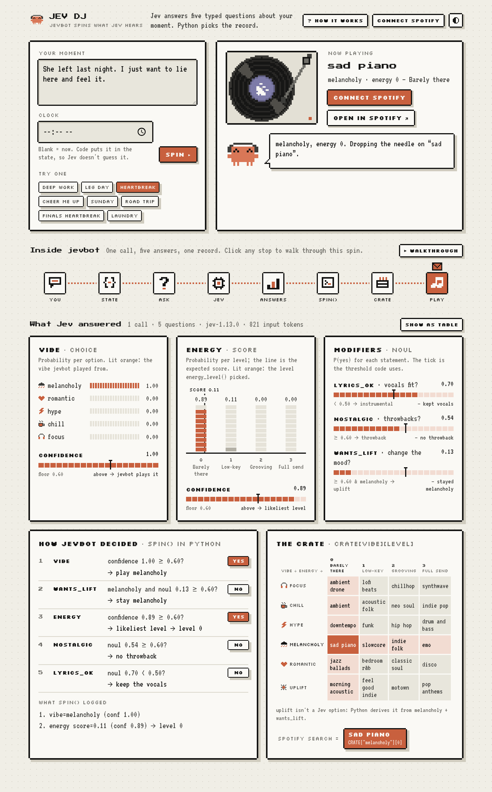
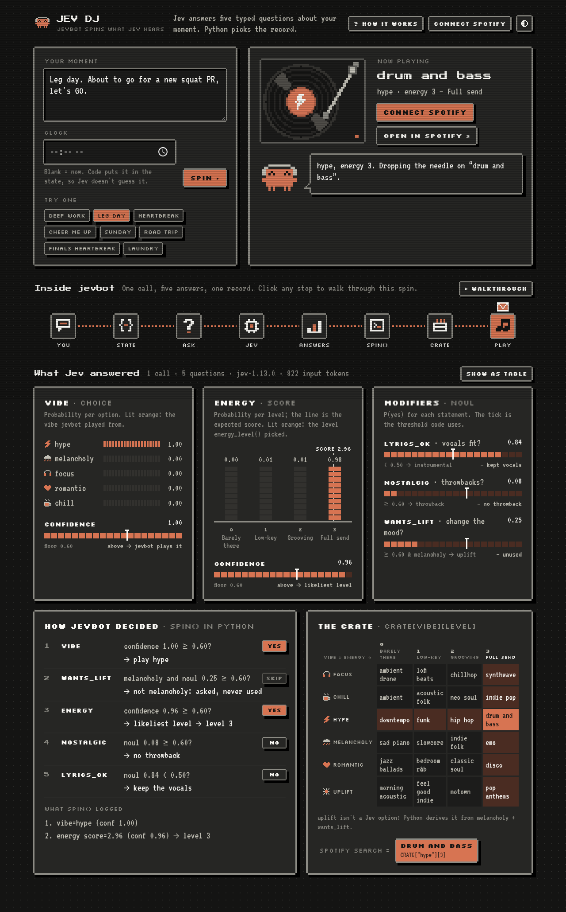
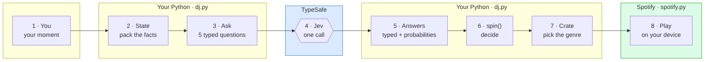
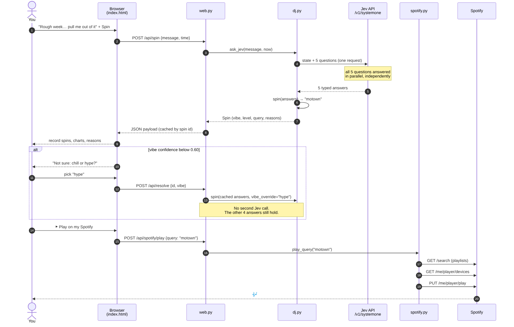
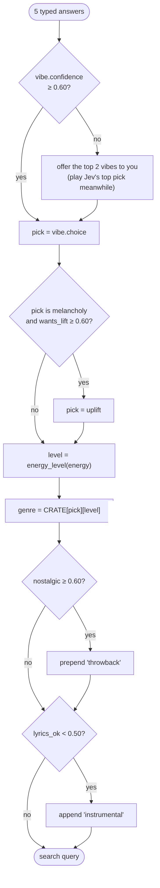

# Jev DJ screenshots and diagrams

These captures show sample spins. Jev's answers can vary between runs. The [walkthrough](how-jev-dj-works.md) contains editable Mermaid versions of the diagrams.

## Web UI

### Light theme

### Dark theme

## How the pieces fit

### Eight-stop overview

### One spin, end to end

### How spin() picks a query

